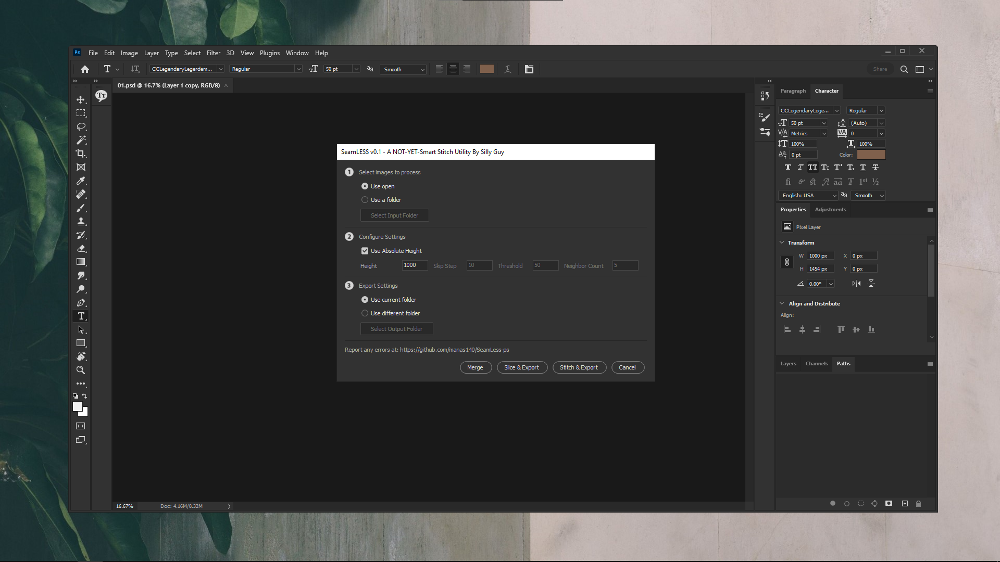

# SeamLess-ps

A Not-Yet-Smart Stitch Utility [ PS SCRIPT ]

  

## Install

- Windows

  - Run `install.cmd` as admin.
  - Restart Photoshop
  - Script available in `Files > Scripts > SeamLess`

- Mac

  - WIP

## Acknowledgement

- [kevinmartz](https://github.com/kevinmartz/UQC-TOOLS/)
