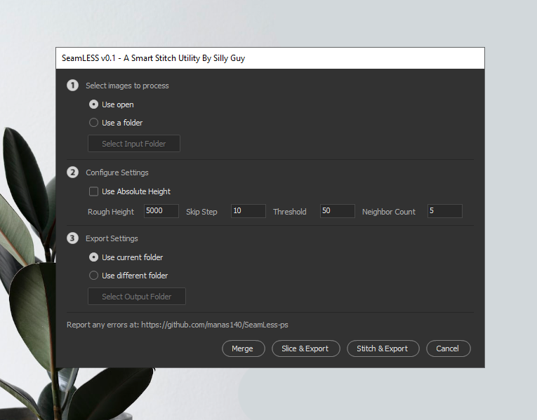

# SeamLess-ps

A Smart Stitch Utility [ PS SCRIPT ]

<p align="center">
  
</p>

## Install

- Windows

  - Download `windows.zip` from `Releases` Tab & Extract it.
  - Run `install.bat` as admin.
  - Restart Photoshop.
  - Find the script in `Files > Scripts > SeamLess`.

- Mac

  - WIP

## Build [ Slice ]

```sh
  cargo build -r --target <target>
```

# Acknowledgement

- [kevinmartz](https://github.com/kevinmartz/UQC-TOOLS/)
